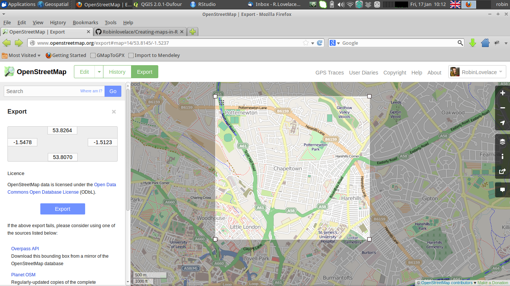

Open Street Map: loading, analysing and visualising the Wikipedia of maps with R and other free tools
========================================================

## Introduction

Open Street Map is a crowd-sourced map of the world, the archetype of 'volunteered geographical information'
(Goodchild 2007). Putting the public in charge of editing the world's surface may seem like a risky 
business, given that cartographers have specialist skills developed over centuries. Yet the emergence 
of high resolution aerial photography covering the entirety of the Earth's surface and the 
explosion in GPS ownership via smartphones has enabled citizens to become accurate sensors of the world, 
with the added advantage that they are likely to know their local areas far better than any cartographer.

Of course there are teething issues with any large-scale open source database, including variable data quality, 
patchy and incomplete coverage and inconsistencies from place to place (Haklay 2010). Yet all of these
issues are gradually being out. The advantages of Open Street Map outweight these downsides for
many applications *already*. These include:

- Rapid updates of new projects
- Greater range of attributes (e.g. shop names)
- Ability to share data with anyone without breaching license

In additions there are a number of ethical benefits of using OSM: it's community
a map for the greater good ([Wroclawski 2014](http://www.theguardian.com/technology/2014/jan/14/why-the-world-needs-openstreetmap)).

## Getting the data

OSM data of a specific area
can be downloaded directly from the [main map page](http://www.openstreetmap.org), from the 
[Overpass API](http://overpass-api.de/) or, for the entire planet, from the huge (currently 32 GB)
[planet.osm file](http://planet.openstreetmap.org/). A number of third parties also provide more manageable
chunks of this dataset, such as the single country datasets provided by
[GEOFABIK](http://download.geofabrik.de/). Command line programs 
[Osmosis](http://wiki.openstreetmap.org/wiki/Osmosis) and 
[Osm2pgsl](http://wiki.openstreetmap.org/wiki/Osm2pgsql) can be used to process raw OSM data 
in either `.osm` or `.osm.pbf` file formats. The former is essentially a `.xml` (Extensible Markup Language)
text file (encoded with the popular UTF-8 characterset); the latter is a compressed version of the former.
How we transfer these datasets into a useful form depends on the program you are using. 
In this tutorial we will explain how to do it in QGIS and R, as well describing the basics of 
getting it into a [PostGIS](http://postgis.net/) database.

### Using QGIS

A `.osm` file can be downloaded from the openstreetmap.org with the bounding box selected by
default depending on the current view, or via a manual selection, as shown below.



To load this file into QGIS, you can simply use the `Add Vector Layer` button on the 
right of the screen. However this does not seem to generate satisfactory results. 
The *recommended* way to import the data is via the the OSM plugin. When this is 
installed in QGIS 2.0, use the menus `Vector > OpenStreetMap` to import the xml file
and convert it into a SpatiaLite databese. Then you can import it into the QGIS workspace. 


After this step the file has been saved as a `.osm.db` file. Use the 
`Export Topology to SpatiaLite` element of the same menu to 
load the file. Choose the type of spatial data you would like to load - 
Points, Lines or Polygons. At this stage one can also select which variables 
("Tags") you would like to add to the attribute data.


The data is now loaded into QGIS allowing standard methods of analysis. 
You will notice that the data are not styled at all, leading to very bland 
maps. To counter this, there have been custom styles developed for visualising OSM data in QGIS, 
e.g. [those by Anita Grazer](http://anitagraser.com/2012/02/25/light-styles-for-osm-layers-in-qgis/). 
Unfortunately these files do not seem to be working with the current version of QGIS so 
alternative ready-made styles must be created, as suggested by a 
[stackexchange question](http://gis.stackexchange.com/questions/42645/is-there-up-to-date-osm-sld-file-for-geoserver). 

### Using osmar 

`osmar` is an R package for downloading and interrogating OSM data that accesses 
the data directly from the internet via the R command line.
There is an excellent [online tutorial](http://journal.r-project.org/archive/2013-1/eugster-schlesinger.pdf)
which provides a detailed account of the package. 
Here we will focus on loading some basic data on bicycle paths in Leeds.
First the package must be loaded:


```r
library(osmar)  # if the package is not already installed, use install.packages('osmar')
```

```
## Loading required package: XML
## Loading required package: RCurl
## Loading required package: bitops
## Loading required package: gtools
## Loading required package: geosphere
## Loading required package: sp
## 
## Attaching package: 'osmar'
## 
## The following object is masked from 'package:utils':
## 
##     find
```


To download data directly, one first sets the source and a bounding box, 
and then use the `get_osm` function to download it. Selecting my house as the 
centrepoint of the map, we can download all the data in the square km surrounding it.


```r
src <- osmsource_api()
bb <- center_bbox(-1.53492, 53.81934, 1000, 1000)
myhouse <- get_osm(bb, source = src)
```

```
## Error: Couldn't resolve host 'api.openstreetmap.org'
```

```r
plot(myhouse)
```

```
## Error: error in evaluating the argument 'x' in selecting a method for function 'plot': Error: object 'myhouse' not found
```

```r
points(-1.53492, 53.81934, col = "red", lwd = 5)
```

```
## Error: plot.new has not been called yet
```


This shows that the data has successfully been loaded and saved as an 
object called `myhouse`. Let's try analysing this object further. 
In fact, `myhouse` is technically a list, composed of 3 objects:
nodes, 


## Spatial subsetting

## Attribution selection

## Analysis and visualisation with R

## Further resources

